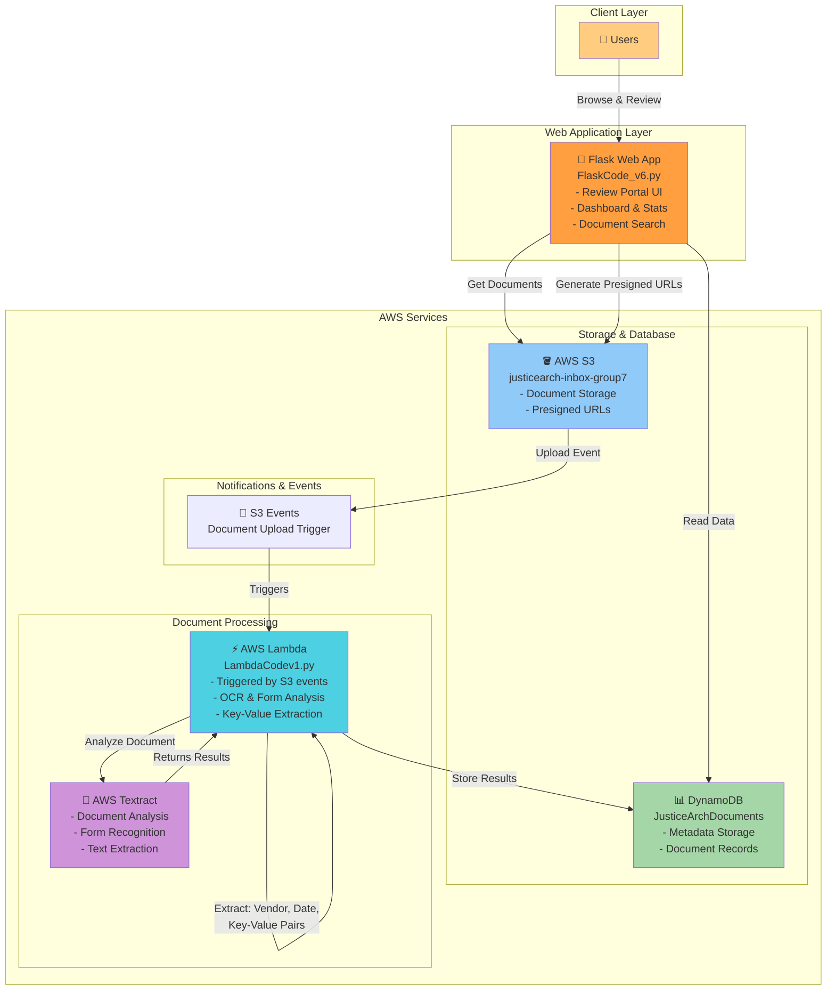

# JusticeArch Document Processing - AWS Architecture

## Architecture Components

### 1. **Web Application Layer**
- **Flask Web App** (FlaskCode_v6.py)
  - Dashboard with statistics (documents by status)
  - Search functionality
  - Document review interface
  - Admin controls for document management
  - Displays presigned URLs for secure document access

### 2. **Storage Layer**
- **AWS S3** (justicearch-inbox-group7 bucket)
  - Stores uploaded documents (PDFs, images, etc.)
  - Generates time-limited presigned URLs (5-minute expiration)
  - Triggers events on document upload

- **DynamoDB** (JusticeArchDocuments table)
  - Stores document metadata
  - Persists extracted information (vendor, date, key-value pairs)
  - Tracks document status and review state

### 3. **Processing Layer**
- **AWS Lambda** (LambdaCodev1.py)
  - Event-driven trigger on S3 uploads
  - Orchestrates document processing workflow
  - Extracts vendor information (from key-value pairs or regex)
  - Extracts date information (date patterns)
  - Stores results in DynamoDB

- **AWS Textract**
  - Performs OCR on uploaded documents
  - Analyzes forms and tables
  - Extracts key-value pairs from structured documents
  - Returns confidence scores

### 4. **Data Flow**
1. User uploads document → S3
2. S3 event triggers Lambda
3. Lambda calls Textract for analysis
4. Textract returns structured data
5. Lambda extracts key information (vendor, date, forms data)
6. Results stored in DynamoDB
7. Flask app retrieves and displays results to users

## Key Features
- ✅ Serverless processing (Lambda + Textract)
- ✅ Secure document access (presigned URLs)
- ✅ Form field extraction
- ✅ Vendor and date recognition
- ✅ Real-time dashboard updates
